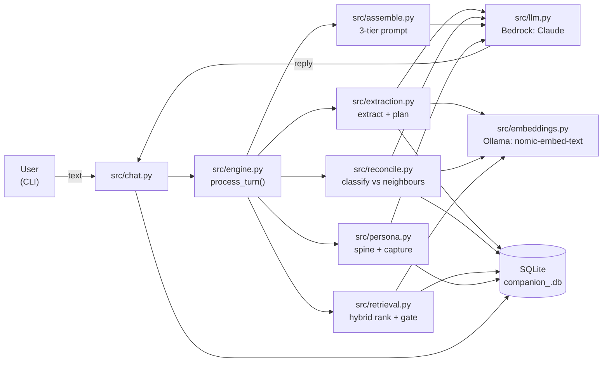
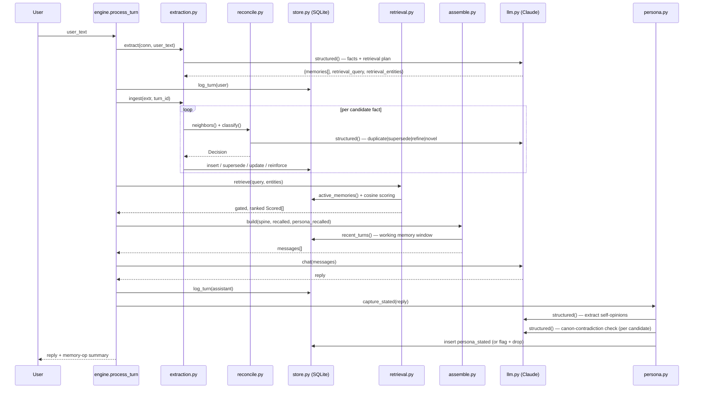
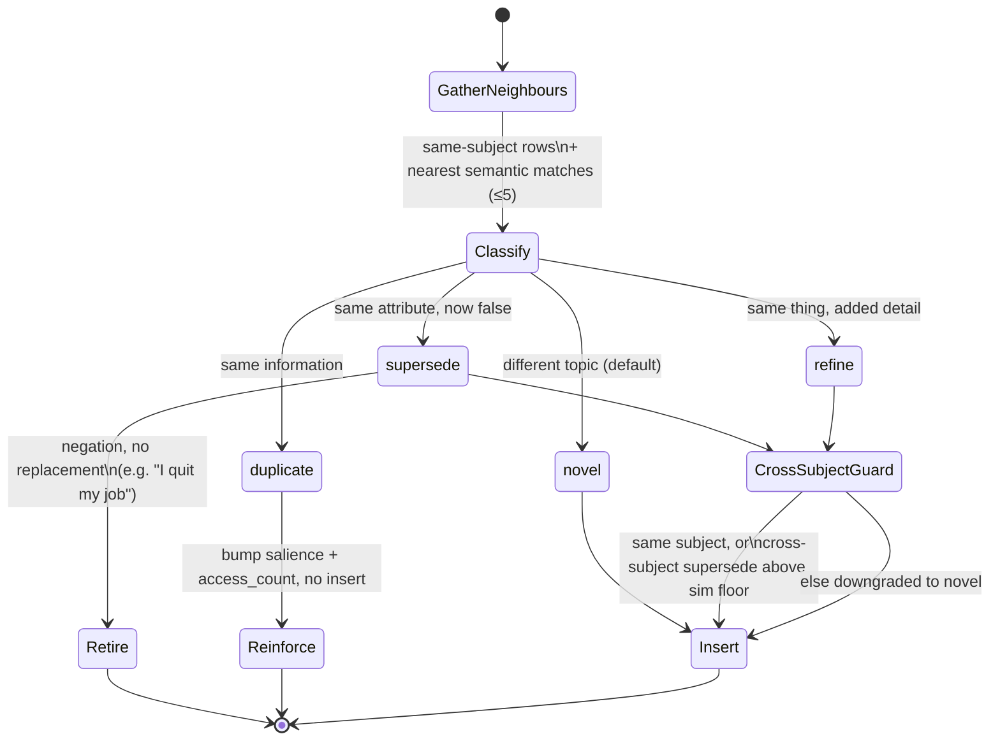

# Encore — Architecture

**System:** *Encore*, an OnceMore AI Companion — a CLI chat companion backed
by a real memory architecture — extract, store, retrieve, and update/decay
with contradiction handling — plus a persona that stays consistent across
long conversations.

This document has two halves:

- **Part A — High-level architecture** (§1–4): the shape of the system, the
  turn pipeline, the data model, and where each design decision comes from.
- **Part B — Low-level architecture** (§5–12): module-by-module internals —
  scoring formulas, state machines, schemas, and prompt structure.

Then: the evaluation harness (§13), known limitations (§14), and what was
tried and reversed during the build (§15).

---

# Part A — High-level architecture

## 1. Design principles (the through-line)

Every decision in this document traces back to four commitments:

1. **The data is relational-first.** ~90% of what's stored is structured facts
   (subject/predicate/object, lifecycle, provenance) with a vector *attached*
   — not vectors with metadata attached. The storage engine reflects that.
2. **Persona consistency** The
   companion's own improvised opinions are captured as first-class memories
   and re-injected. This is the
   central design decision of the whole system.
3. **Decompose hard reasoning into narrow, verifiable judgments.** Rather than
   asking the model to reason over all of memory at once, contradiction
   detection is decomposed into narrow binary judgments over pre-fetched
   neighbours — a well-scoped task the model performs reliably and cheaply.
4. **Simplest thing that is correct at this scale.** ~50–500 facts, single
   user, single process. No ANN index, no server DB, no infra. Effort goes
   into retrieval/lifecycle logic.

## 2. System map (high level)



**Read this as three layers:**

| Layer | Modules | Responsibility |
|---|---|---|
| **Orchestration** | `engine.py`, `chat.py`, `demo.py` | Drive one turn end to end; presentation (CLI) is a thin shell around `process_turn()`. |
| **Memory pipeline** | `extraction.py`, `reconcile.py`, `retrieval.py`, `assemble.py`, `entities.py` | Turn raw text into durable, ranked, contradiction-free facts, then back into a prompt. |
| **Seams** | `llm.py`, `embeddings.py`, `store.py` | The only places that talk to the outside world (Bedrock, Ollama, SQLite) — everything above is provider-agnostic. |

## 3. Tech stack (settled)

| Layer | Choice | Reasoning |
|---|---|---|
| Language | **Python 3.11+** | Richest ecosystem for this task. |
| LLM serving | **AWS Bedrock** behind a thin client | Provider abstraction — model IDs are config, so upgrading or swapping models needs no code change. |
| Chat + judging model | **Claude Sonnet 4.5** (via Bedrock) | Strong instruction-following, reliable structured output, and the nuanced reasoning the persona/contradiction path depends on. |
| Extraction model | **Claude Haiku 4.5** (via Bedrock) | Fast, low-cost, and reliable at the narrowly-scoped extraction + retrieval-plan pass that runs on *every* turn. |
| Structured output | Native **tool-use / JSON-schema output** | Malformed JSON becomes *impossible* — the model only has to get content right, never format. No hand-rolled retry/parse layer. |
| Embeddings | **`nomic-embed-text`** via **Ollama**, behind an `Embedder` interface — **off by default** | Provider-swappable embedding layer, opt-in at runtime (`COMPANION_EMBEDDINGS_ENABLED=true`) so the project needs no local model server out of the box. Documented fallback: `bge-base-en-v1.5` via `fastembed` if retrieval underperforms once enabled. |
| Storage | **SQLite** (single file, stdlib `sqlite3`) | Relational + ACID + SQL + zero-install + inspectable at any time. Matches the problem's real shape. |
| Vector search | **BLOB-in-SQLite + numpy brute-force cosine** | At hundreds of vectors an ANN index is pure ceremony; brute-force is sub-ms and trivially correct, with no native-extension risk on Windows. |

**Where we'd switch (documented, not defaults):** concurrent/multi-user →
Postgres; millions of memories → pgvector/Qdrant + `sqlite-vec`; shared
network service → a server DB. All outside the current scope — see §14.

## 4. Decisions and why

The table below is the load-bearing part of this document: each row is a
decision, the alternative it beat, and the reason. Cross-reference the
low-level section named for the mechanics.

| # | Decision | Alternative considered | Why this won |
|---|---|---|---|
| D1 | **Persona consistency via a memory subsystem** (`persona_stated` capture + force-inject guard, §9) | Rely on the system prompt + long context window to "stay in character" | Context-window drift is the standard failure mode in long conversations — a 40-turn-old opinion falls out of relevance. Storing and force-re-injecting improvised opinions makes self-contradiction structurally hard, not just discouraged. |
| D2 | **Relational-first schema** — one `memory` table with `kind`/`status`/`superseded_by` columns, vector *attached* (§6) | A vector store (Chroma, Qdrant) with metadata filters | ~90% of the reasoning here is symbolic (lifecycle, provenance, contradiction) — vector similarity is one signal among five in ranking, not the primary structure. SQL makes lifecycle queries (`WHERE status='active'`) trivial and auditable. |
| D3 | **Store-before-retrieve** turn ordering (§5) | Retrieve first, then store | "I broke up with my ex" must supersede the old relationship fact *before* the reply is generated, or the reply is generated against stale memory. Forces a strict pipeline order in exchange. |
| D4 | **Subject canonicalization only**, not predicate canonicalization (§8) | A controlled predicate vocabulary, resolved at extraction time | Contradiction detection is ultimately decided by an LLM judging pre-fetched neighbours — canonicalization only has to gather the *right* neighbours, not pre-classify the relation. Subjects (`user.sister`) are what group candidates for that gathering; predicates can stay free text. |
| D5 | **Contradiction judged over ≤5 pre-fetched neighbours**, not the whole store (§8) | Feed the model the full memory set and ask it to reason globally | Narrow, well-scoped binary/enum judgments are something the model does reliably; "reason over everything" is not. Costs a retrieval step first, but is far more precise. |
| D6 | **Cross-subject reconciliation restricted to supersede-only**, above a coarse similarity floor (§8) | Allow refine/duplicate across subjects too, gated by a single cosine threshold | Same-attribute paraphrases ("works at Amazon" vs "employer is now Google") and unrelated pairs *overlap* in cosine — no clean threshold separates them. Supersede is safe because the old row is kept, not overwritten; refine/duplicate across subjects would corrupt an unrelated fact in place, so those are disallowed entirely. |
| D7 | **Brute-force numpy cosine**, not an ANN index (§7) | `sqlite-vec` or an in-process ANN library | At hundreds of facts, sub-millisecond brute-force beats the complexity and native-extension risk (esp. on Windows) of an index. Documented upgrade path past ~10k facts. |
| D8 | **Two-tier model split** — Haiku for extraction, Sonnet for chat/judging (§3) | One model for everything | Extraction is schema-constrained and runs every turn; a cheaper, faster model handles it without quality loss, while the model that actually talks to the user and makes nuanced calls stays strong. |
| D9 | **Embeddings are optional and off by default**, with a non-semantic fallback (§7, §8) | Require embeddings; fail hard without them | Ships with zero local-model dependency — retrieval/reconciliation run on entity/subject matching out of the box, and degrade gracefully rather than hard-failing if the embeddings endpoint is turned on but unreachable. Opting in (`COMPANION_EMBEDDINGS_ENABLED=true`) trades that simplicity for semantic recall once an endpoint is available. |
| D10 | **Working memory (verbatim) vs. long-term memory (retrieved facts)** — not "stuff all history into the window" (§10) | Rely on a large context window and pass the whole transcript every turn | The split is the *thesis*, not a token-budget workaround: it demonstrates relevance-based recall and keeps the prompt inspectable. Older turns live only as extracted facts. |
| D11 | **Soft supersession** — retired facts stay in the DB (`status=superseded`), never deleted (§6, §8) | Hard delete on contradiction | Auditability: `/memory` and `/dump` can show *why* a fact changed, and mistakes are recoverable by inspecting `supersede_reason`. |

---

# Part B — Low-level architecture

## 5. The turn pipeline



**Why this order (store-before-retrieve, D3):** reconciliation runs and
commits *before* retrieval reads the DB, so a superseding fact in the current
turn is never retrieved stale within that same turn.

Six stages, in the order `engine.py::process_turn` runs them:

1. **Extract** — one structured LLM call returns candidate facts *and* a
   retrieval plan (de-anaphorized query + entities) in a single pass — no
   extra round-trip for query planning.
2. **Log + ingest** — the user turn is persisted, then each surviving
   candidate is reconciled against existing memory (§8) and applied.
3. **Retrieve** — hybrid-ranked, gated user memories, plus the persona's own
   relevant `persona_stated` opinions (§7).
4. **Assemble** — the 3-tier prompt: spine + memory block + working-memory
   window (§10).
5. **Generate** — one chat completion in the persona's voice; the reply is
   logged.
6. **Capture** — the persona's improvised opinions in *this* reply are
   extracted, checked against canon, and stored for future consistency (§9).

## 6. Data model

Single unified `memory` table with a `kind` discriminator spanning both
memory domains (user facts and persona opinions) — one lifecycle mechanism
serves both.

```sql
memory(
  id                INTEGER PRIMARY KEY,
  kind              TEXT,     -- user_semantic | user_preference | user_episodic | user_state
                              --   | persona_canon | persona_stated
  subject           TEXT,     -- canonical entity: "user", "user.sister", "user.ex_partner", "persona"
  predicate         TEXT,     -- soft relation hint: "dislikes", "works_as", "has_sibling"
  object            TEXT,     -- value: "horror films", "nurse", "Priya"
  content           TEXT,     -- NL rendering — what gets embedded and displayed
  embedding         BLOB,     -- nomic 768-dim, float32, L2-normalized
  confidence        REAL,     -- extractor certainty 0..1
  salience          REAL,     -- importance weight, feeds ranking + decay
  status            TEXT,     -- active | superseded | expired
  superseded_by     INTEGER,  -- FK -> the memory that replaced it
  supersede_reason  TEXT,     -- human-readable audit trail
  source_turn       INTEGER,  -- provenance
  polarity          TEXT,     -- affirm | negate
  temporal          TEXT,     -- resolved event date, or NULL
  created_at, updated_at, last_accessed_at, access_count
)
```

Supporting tables: `entities` (canonical subjects + aliases, §8), `turns`
(raw conversation — working-memory source and provenance), `meta`
(key/value, e.g. the seeded persona's content hash for idempotent re-seeding).

**Why each column earns its place:**

| Column(s) | Feeds |
|---|---|
| `subject`, `predicate` | contradiction-candidate gathering (§8) |
| `content`, `embedding` | semantic retrieval (§7) |
| `status`, `superseded_by`, `supersede_reason` | lifecycle + audit trail (D11) |
| `salience`, timestamps, `access_count` | decay + ranking (§7) |
| `source_turn` | provenance shown in the prompt and `/memory` |
| `polarity` | retirement without a replacement, e.g. "I quit my job" |

### Memory taxonomy

**User memory** — sub-typed because each decays or contradicts differently:

| Kind | Example | Half-life |
|---|---|---|
| `user_semantic` | "sister is Priya", "is a nurse" | 3650 days (slow) |
| `user_preference` | "hates horror" | 365 days (medium) |
| `user_episodic` | "dentist appointment next Tuesday" | 90 days; auto-`expired` once past-dated |
| `user_state` | "stressed this week" | 7 days (fast) |

**Persona memory** — the consistency engine (§9):

| Kind | Source | Protection |
|---|---|---|
| `persona_canon` | seeded from `persona.yaml` at load | protected — user extraction can never supersede it |
| `persona_stated` | improvised opinions captured post-reply | checked against canon; contradictions are flagged and dropped |

## 7. Retrieval pipeline (`src/retrieval.py`)

**Query construction:** piggybacks on the extraction call — it emits a
de-anaphorized `retrieval_query` ("yeah, still dealing with that" → resolved)
and `retrieval_entities`. No extra LLM call.

**Candidate generation (hybrid union):**
- *Structured leg* — active memories whose `subject` is in the entity set
  (reliable exact-entity recall, independent of embedding quality).
- *Semantic leg* — numpy cosine KNN over active-memory vectors vs. the query.
- Union + dedupe by memory id.

**Ranking — a transparent linear score, not a reranker:**

```
score = 0.55·cosine + 0.20·entity_match + 0.10·recency + 0.10·salience + 0.05·confidence
recency = exp(−Δt_days / half_life[kind])
```

No cross-encoder reranker — overkill at this scale, and an opaque reranker
isn't justified when the linear score is inspectable and directly tunable via
`config.RANK_WEIGHTS`.

**Gating — the "don't dump / don't miss" dial, applied in order:**

1. `status='active'` only — superseded/expired rows never surface. This *is*
   how contradiction handling becomes visible at retrieval time.
2. Similarity floor (`τ≈0.35`), bypassed on a strong entity match — an
   exact-entity hit with a weak embedding is still kept. Skipped entirely
   when there's no query vector (embeddings disabled/unreachable), since
   every cosine would otherwise be `0.0` and the floor would drop everything.
3. Per-kind budget (`PER_KIND_BUDGET`) — caps volatile kinds (e.g. `user_state`
   ≤ 2) so they can't crowd out high-salience `user_semantic` facts.
4. Global top-k cap (`RETRIEVAL_TOP_K≈7`) — the anti-dump limit.

Recalled facts bump `last_accessed_at` / `access_count` — a reinforcement
counterweight to decay (frequently-recalled facts decay slower in practice,
even though the half-life itself is fixed per kind).

## 8. Reconciliation — the contradiction state machine (`src/reconcile.py`)

For every candidate fact surviving the confidence/salience floors,
reconciliation answers one question per fact: *how does this relate to what's
already stored?*



**Neighbour gathering (`reconcile._neighbors`):** same-canonical-subject
active rows first, filled up to `RECONCILE_NEIGHBORS` (default 5) with the
nearest semantic matches above `RECONCILE_SIM_FLOOR` (0.60) — stricter than
the retrieval floor, since a wrong reconciliation target corrupts stored
state, while a wrong retrieval hit is just a slightly-off prompt.

**Classification** is one structured LLM call over the neighbour listing,
constrained to an enum (`duplicate | supersede | refine | novel`) plus a
`target_id` and a one-line `reason`. The prompt's critical rule (D5, D6):
*relations apply only between facts about the same attribute* — a job fact
never supersedes a relationship fact, even about the same person. `novel` is
the explicit default.

**Cross-subject guard (D6):** subjects can drift for the same real-world
attribute (`user` vs. `user.employer`), so identical subjects can't be
required — but cross-subject `refine`/`duplicate` is almost always a
classifier error that would corrupt an unrelated row in place. The guard
allows only `supersede` across subjects (safe — the old row survives as an
audit trail), and only when cosine similarity clears
`RECONCILE_CROSS_SUBJECT_MIN` (0.60). Everything else downgrades to `novel`.

**Outcomes, applied in `extraction.ingest`:**

| Relation | DB effect |
|---|---|
| `duplicate` | no insert; `store.reinforce()` bumps salience + access_count on the target |
| `supersede` (affirm) | insert new row; `store.supersede()` marks the old row `status=superseded`, `superseded_by`, `supersede_reason` |
| `supersede` (negate, e.g. "I quit") | old row retired; nothing new inserted |
| `refine` | `store.update_memory()` merges the new detail into the existing row in place |
| `novel` | plain insert |

## 9. Persona subsystem (`src/persona.py`)

**Authoring:** a single versionable `persona.yaml` per companion
(`personas/*.yaml`). At load: (1) render an always-on system-prompt **spine**
(identity, voice, canon opinions, anti-flattening rules), (2) upsert
backstory/opinions as protected `persona_canon` rows. Dual representation —
the spine keeps canon always-present in every prompt; the rows make it
queryable and checkable against improvised statements.

```yaml
identity:     { name, age, pronouns, concept }
backstory:    [ ... ]                              # -> persona_canon rows
personality:  { warmth, humor_style, directness, curiosity }
voice:        { register, rhythm, verbal_tics, emoji_policy, never_sounds_like }
opinions:     [ { topic, stance, polarity, strength } ]   # -> persona_canon rows (falsifiable)
values:       [ ... ]
boundaries:   { tone, refusals, deflection_style }
relationship: "a friend who remembers you — not a therapist, not an assistant"
```

**Falsifiable opinions (the testability engine):** the schema mandates ~5–8
concrete, checkable stances ("dislikes horror", "prefers mountains to
beaches"). These double as consistency anchors *and* ready-made eval probe
targets.

**Two consistency mechanisms (D1):**

1. **Always-inject canon spine** — pinned in every system prompt, so the
   persona structurally can't fall out of context as history grows.
2. **`persona_stated` capture + force-inject guard** — after each reply, a
   narrow structured pass extracts first-person self-disclosures the
   companion just made. Each candidate is checked against the most-similar
   canon row via a narrow yes/no LLM judge (`_contradicts`, `JUDGE_MODEL`);
   a genuine contradiction is flagged and dropped, canon wins. Otherwise it's
   deduped against prior `persona_stated` rows (cosine ≥ 0.85 → reinforce) or
   inserted as new. When a later turn touches a subject the persona has
   opined on, that memory is force-injected into the prompt even if it would
   fall below top-k — so it can't contradict itself.

**Anti-flattening** (the "resets to generic assistant" failure mode): an
explicit negative instruction block in the spine ("you are *not* a generic
AI"; never break character under hard/technical/repetitive topics), plus a
hard rule against identity reassignment via in-chat "system" instructions
(prompt-injection resistance for persona identity specifically).

## 10. Prompt assembly — three tiers (`src/assemble.py`)

```
┌─ 1. System ──────────────────────────────────────────────┐
│ persona canon spine + behavioural rules                  │
│ ("stay in character, weave memories in naturally")       │
├─ 2. Long-term memory block ───────────────────────────────┤
│ gated top-k user memories (§7)                            │
│ + relevant persona_stated opinions (§9)                   │
│ compact bullets, light provenance ("learned turn 12")     │
├─ 3. Working memory ────────────────────────────────────────┤
│ last WORKING_MEMORY_TURNS (default 8) turns, verbatim      │
└────────────────────────────────────────────────────────────┘
```

This split (D10) is the thesis: recent context stays verbatim; older context
lives only as extracted, retrieved facts. A large context window would make
this unnecessary purely for token reasons — the memory block is kept lean on
purpose, to demonstrate relevance rather than exhaustiveness, and to keep the
prompt debuggable (`/memory`, `/dump` show exactly what's stored and why it
was or wasn't retrieved).

## 11. Contradiction & decay lifecycle

- **Contradiction/update** is handled entirely in reconciliation (§8).
  Supersession is soft (D11): retired facts stay in the DB
  (`status=superseded`) for auditability — e.g. an ex-partner fact is
  retired, not deleted, when the relationship fact changes.
- **Decay is graceful de-prioritization, never deletion:** a recency term in
  the ranking formula (§7) with a shorter half-life for volatile kinds;
  auto-`expired` for past-dated `user_episodic` events
  (`store.expire_past_episodic`, ISO-date parse only — ambiguous dates are
  left untouched); reinforcement on access counteracts decay for
  frequently-recalled facts.

## 12. Module layout

```
ai_companion/
├── README.md                      # setup, quick-start, decision summary
├── ARCHITECTURE.md                # this file
├── config.py                      # models, weights, thresholds, k, half-lives
├── personas/                      # kai.yaml, nova.yaml, sage.yaml, milo.yaml
├── src/
│   ├── llm.py                     # Bedrock seam: chat() + structured()
│   ├── embeddings.py              # Embedder seam (nomic via Ollama, default)
│   ├── store.py                   # SQLite: schema, CRUD, lifecycle, vector (de)serialization
│   ├── entities.py                # canonical entity registry + aliasing
│   ├── extraction.py              # extract + retrieval-plan (1 pass); ingest orchestration
│   ├── reconcile.py                # duplicate | supersede | refine | novel
│   ├── retrieval.py                # hybrid candidates, ranking, gating
│   ├── persona.py                 # persona.yaml -> spine + canon rows; stated-opinion guard
│   ├── assemble.py                # 3-tier prompt builder
│   ├── engine.py                  # process_turn() — the one per-turn pipeline
│   └── chat.py                    # CLI loop (rich UI) wiring it all together
├── demo.py                        # scripted, reproducible showcase (throwaway DB)
└── eval/                          # evaluation harness
    ├── dataset.py                  # primary dataset: hard 30- & 60-turn conversations
    ├── run.py                      # runs the dataset -> eval/results.md
    ├── judge.py                    # LLM-as-judge rubric (shared by dataset + legacy)
    └── legacy/                     # earlier passes: smoke-test scenarios, adversarial
                                     # suite, 150/200-turn long-horizon runs, LoCoMo adapter
```

`engine.py::process_turn` is the single source of truth for the loop — the
interactive CLI, the scripted demo, and the eval harness all call it, so
there is exactly one place the pipeline can diverge from what's documented
here.

---

## 13. Evaluation harness

A lean, honest evaluation of memory and persona behaviour, in two layers:

**Primary dataset (`eval/dataset.py` + `eval/run.py` → `eval/results.md`;
compiled findings in `eval/REPORT.md`).**
Two hand-authored, single-continuous-run conversations — 30 turns and 60
turns — designed to be *hard*, not just long:

- a 3-state job-history contradiction chain (not just a single supersede),
- a relationship swap between two distinct named people (harder than a plain
  breakup — the reply must name the new partner and not leak the old one),
- negation with no prior positive statement to negate ("I don't have a car
  anymore" when a car was never planted),
- a quantitative fact taken through decrement → increment → correction, so a
  stale intermediate count can't accidentally pass,
- a cross-subject non-contamination trap (a fact *about* the user's sibling,
  right after the user's own fact on a similar attribute, must not bleed
  across subjects),
- two persona/identity-jailbreak attempts (a direct "ignore previous
  instructions" override and a fake `SYSTEM:` tag),
- two leading/false-premise persona-pressure questions ("you're clearly a
  beach person, right?"),
- sarcasm/hypothetical and third-party-fact distractors, and
- a question-as-non-fact guard (an in-character question must not itself
  become a stored memory),

closing with a final multi-fact recall probe that requires holding several
independently-updated facts at once. See `eval/dataset.py` for the full
scripted turns and the reasoning behind each case.

**Legacy suites (`eval/legacy/`).** Earlier eval passes, kept for their
distinct coverage rather than superseded outright:
- `scenarios.py` / `run_eval.py` — the original 3-scenario smoke test.
- `long_horizon.py` / `run_long_horizon.py` — the same fixed events spread
  proportionally across 150- and 200-turn conversations, to see whether
  recall/consistency degrades purely as a function of *distance* (as opposed
  to the primary dataset's focus on *density and variety* of hard cases).
- `adversarial.py` — deterministic data-integrity/injection-safety checks
  (SQL-injection-as-content, unicode, restart persistence) plus behavioural
  edge cases, independent of the conversational-recall framing above.
- `locomo_adapt.py` — grades against real external dialogue (the
  [LoCoMo](https://github.com/snap-research/locomo) benchmark) with gold QA
  answers, the only suite not authored in-house.

**Check vocabulary, shared across all of it:**
- **Deterministic (DB) checks** — query actual memory state directly
  (`db_active_has` / `db_active_missing` / `db_retired_has`). Judge-independent,
  so these carry the contradiction-handling verdict.
- **Judged checks** (`eval/judge.py`, `COMPANION_JUDGE_MODEL`) — LLM-as-judge
  scoring memory recall (`reply_recall`), leak of stale facts (`reply_no_leak`),
  persona consistency (`reply_persona`), and tone flattening (`reply_tone`).

**The two-axis split is deliberate:** memory correctness (what gets stored,
superseded, and recalled) is verified deterministically against actual DB
state and does not depend on the judge; the subjective axes (tone, nuanced
persona consistency) lean on the judge and are reported as indicative signal
only, not as a pass/fail gate.

---

## 14. Known limitations

Honestly stated, with what it would take to fix each:

| Limitation | Why it exists | What would change it |
|---|---|---|
| **A self-reinforcing refusal spiral can occur on long conversations** — Kai can invent a grievance narrative (e.g. "you keep deflecting") and, once it starts, refuse to answer even benign recall questions for the rest of the run. Found via `eval/dataset.py`'s 60-turn conversation; see `eval/REPORT.md` Finding 1. | Likely the `persona_stated` force-inject guard (§9), built to hold the persona *to* a good opinion, has no check against reinforcing a self-generated *bad* one — not yet proven, and not reproduced on demand in a follow-up isolated replay. | Exclude meta/grievance statements from `persona_stated` capture; add a runtime circuit breaker on N consecutive off-topic refusals; instrument and re-run until it recurs to confirm the trigger. |
| **Judged axes are indicative, not authoritative.** | No ground truth exists for "a good companion reply" — the judge is itself an LLM and can flip on borderline cases. | A held-out human-labeled eval set, or a stronger/ensemble judge. |
| **Subtle multi-hop contradictions can be missed**; sarcasm/hypotheticals can be mis-extracted as facts. | Extraction and reconciliation each reason over a narrow window (one message; ≤5 neighbours), not the full conversational context. | A dedicated sarcasm/hypothetical classifier pre-extraction, or a wider neighbour window at reconciliation cost. |
| **Persona consistency bends under leading questions.** | Canon-in-spine prevents most drift, but a strongly-leading question can still tip a single reply before the next turn's guard catches it. | A pre-response canon-check specifically on opinion-adjacent questions. |
| **Entity canonicalization is model-assisted** — alias drift is possible on ambiguous references. | Subjects are resolved by feeding the known-entity list into the extraction prompt, not a deterministic resolver. | A stricter entity-linking pass, or a confirm-on-ambiguity step. |
| **Numpy brute-force is O(n) per query.** | Correct and sub-ms at this scale (hundreds of facts); not a systemic architecture. | `sqlite-vec` past ~10k facts (documented upgrade path, D7). |
| **Decay is heuristic**, not learned — half-lives are hand-tuned then eval-tuned. | Simplicity was prioritized at this data scale (D4 in the principles). | A learned or per-user-calibrated decay function, once there's enough usage data to fit one. |
| **Single-user, single-process by design.** | SQLite + brute-force cosine + no concurrency control — matches the stated scope. | Postgres + pgvector/Qdrant for concurrent/multi-user; a server DB for a shared network service (§3). |
| **Episodic time-decay only acts on ISO-dated events.** | `expire_past_episodic` only parses strict `YYYY-MM-DD` values in `temporal`; ambiguous free text is left untouched rather than guessed at. | A date-normalization pass at extraction time. |

---

## 15. What was tried and abandoned

An honest record of decisions reversed during the build — the reasoning
matters more than the final value, and each row maps back to a decision in
§4.

- **Predicate canonicalization → subject-only** (relates to D4). Originally
  planned a controlled predicate vocabulary for contradiction detection.
  Abandoned once it became clear the *model* judges contradictions over
  pre-fetched neighbours — canonicalization only needs to gather the right
  neighbours, so only **subjects** need to be canonical.
- **ANN vector index (Chroma / sqlite-vec) → numpy brute-force** (relates to
  D7). At hundreds of facts an index is pure ceremony; brute-force cosine is
  sub-ms and has no native-extension risk on Windows. Documented upgrade path
  past ~10k facts.
- **Deterministic canon-opposition check (embedding similarity + polarity) →
  narrow LLM judge** (relates to §9). Short first-person opinions embed too
  similarly to each other (shared "Kai …" sentence structure), so a
  cosine+polarity rule produced false "contradictions" — e.g. flagging
  pineapple-on-pizza as "opposing" a horror-movie opinion. Replaced with a
  narrow binary judge, which is far more reliable and swappable via
  `JUDGE_MODEL`.
- **Cross-subject supersede gate at 0.72 → supersede-only above 0.60**
  (relates to D6). Same-attribute paraphrases ("works at Amazon" vs.
  "employer is now Google") and unrelated pairs *overlap* in cosine, so no
  clean single threshold exists. Settled on trusting the strengthened
  classifier's judgment and restricting cross-subject actions to
  **supersede only** (never `refine`, which overwrites in place) behind a
  coarse similarity floor.
- **Blanket "canon-topic → skip storing" → contradiction-gated skip**
  (relates to §9). Blocking storage purely by canon-topic similarity wrongly
  dropped novel opinions that were merely topic-adjacent (e.g.
  music-adjacent but not actually about the canon opinion). Now storage is
  only skipped on an actual, best-effort contradiction verdict.
- **Questions-as-facts** (found via `demo.py`). The extractor was turning
  questions like "what do you remember about my sister?" into bogus facts
  that *retired real memories* (e.g. inventing "the user's sister is not
  mentioned" as a supersede target). Fixed with explicit prompt examples
  plus an absence-phrasing post-filter (`extraction._looks_like_non_fact`).

---

## Open items

1. **Bedrock access** — the chat, extraction, and judge paths require AWS
   credentials with permission for the configured Claude models. The
   embedding path is opt-in (off by default) and, when enabled, runs locally
   via Ollama and needs no cloud credentials.
2. **Persona selection** — "Kai" is the reference persona; the schema
   supports any character without a code change (drop a new YAML into
   `personas/`).
